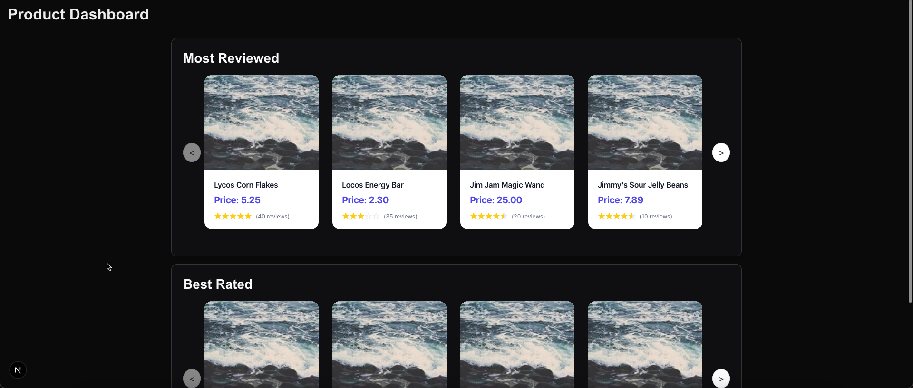

# Product Dashboard

A visualization tool that displays products based on performance metrics, featuring two product carousels:
- Most reviewed products
- Best rated products

## Getting Started
1. Create an `.env` file with value `PORT=3000`.
2. Run `npm ci`.
3. In your first terminal tab, run `npm run api`.
4. In your second terminal tab, run `npm run dev`.
5. Assuming everything went well, navigate to http://localhost:3001/product-dashboard, where you should see the
product dashboard.

## Linting and Testing
1. To run lint locally, in the root of the project the following.
   - `npm run lint`
2. Backend tests can be run using `npm run test:be`, these use Jest.
3. Frontend tests can be run headlessly using `npm run test:fe`.
4. If you need to add new cypress tests, you can open the cypress UI via `npm run cypress`.

## Pull Request Workflows
All PRs must pass CI checks before merging. Run the following locally to verify: `npm run test:ci`.
